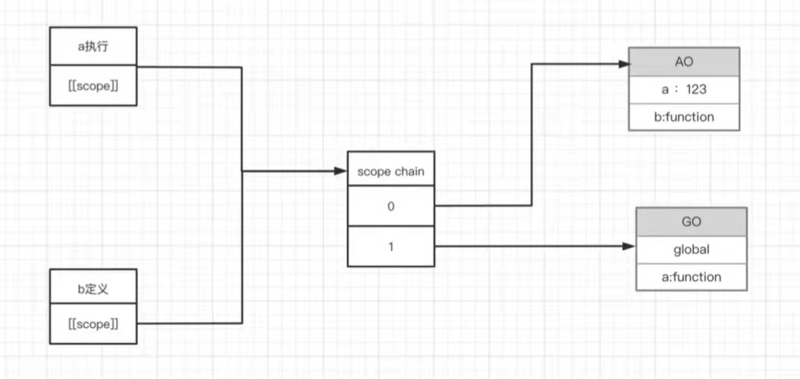
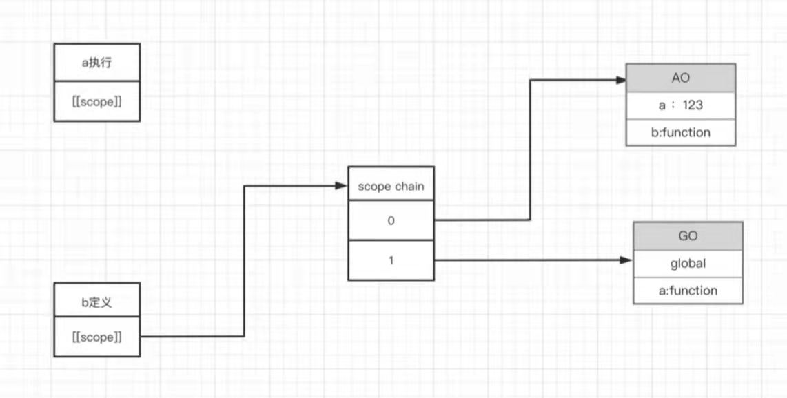

## 作用域：一般指变量的作用范围

1. 全局作用域
(1) 页面打开创建，关闭销毁
(2) 全局作用域中声明的变量、函数会作为window对象的属性和方法

2. 函数作用域
(1) 调用函数时，函数作用域被创建，函数执行完毕，函数作用域被销毁
(2) 每调用一次函数就创建一个新的函数作用域，他们之间是相互独立的

3. 块级作用域

## 作用域的深层次理解

##### 执行期上下文
- 当函数代码【执行】的前期(预编译)，会创建一个执行期上下文的内部对象AO（作用域）
- 在全局代码【执行】的前期(预编译)，会创建一个执行期的上下文的对象GO

# 函数预编译
1. 创建AO对象
2. 找形参和变量的【声明】 作为AO对象的属性名 值是undefined
3. 实参和形参相统一
4. 找函数声明 会覆盖变量声明
# 全局作用域的预编译
1. 创建GO对象 
2. 找变量声明 作为GO对象的属性名 值是undefined
3. 找函数声明 值赋予函数体

##### 作用域链
- 会被保存到一个隐式的属性中去 `[[scope]]` 这个属性是我们用户访问不到的，但是的的确确是存在的，让sj引擎来访问的，里面存储的就是作用域链。AO和GO的集合

```js
  var global
  function a() {
    // 当a()执行时，进入这里，b函数才能被定义
    function b() {
      // 当b()执行时，进入这里
      var bb = 123
      aa = 0
    }
    var aa = 234
    b()
  }
  a() // 执行完后会销毁作用域链
  a() // 再次执行时会重新创建作用域链，执行完后再销毁

  // 当b执行时，产生自己的AO，并能看到所有父级的作用域链
  AO{
    bb: 123, 
    this: window
  }

  // 当a执行时，产生自己的AO，此时可以看到下面所有作用域；a执行时，b被定义，即b定义时也是看到下面所有作用域
  AO{
    aa: 234,
    b: function
  }

  // 当a定义时，此时可以看到下面所有作用域
  GO{
    global: undefined,
    a: function
  }

```
```js
  function a() {
    var aa = 123;
    function b() {
      var bb = 234;
      console.log(aa)
    }
    return b
  }
  var res = a()
  res()
  
  // b执行时
  AO {
    bb: 234
  }

  // a执行时，b被定义，可以看到以下所有作用域
  AO{
    aa: 123,
    b: function
  }

  // 此时a定义，可以看到以下作用域
  GO {
    a: functon,
    res: function a(){...}
  }

  // 闭包的原理，当res()执行时，因为b函数被包存在了外部，即使a()函数执行完后会销毁，但是a()执行时，b被定义，此时b的作用域链里是可以看到a执行时的作用域AO。因此可以取到aa: 123。
```
- a执行，b被定义，此时b可以看到图上AO、GO的作用域


- a()函数执行完后会销毁，但是a()执行时，b被定义，此时b的作用域链里是可以看到a执行时的作用域AO。因此可以取到aa: 123。


- 阿里题
```js
function fn (a, c) {
  console.log(a)
  var a = 123
  console.log(a)
  console.log(c)
  function a () {}
  if (false) {
    var d = 678
  }
  console.log(d)
  console.log(b)
  var b = function () {} // 函数表达式，不是函数声明
  console.log(b)
  function c() {}
  console.log(c)
}
fn (1, 2)

// 预编译过程
A0 {
  a: undefined --step3-实参覆盖--> 1 --step4-函数声明覆盖--> f a () {}
  c: undefined --step3-实参覆盖--> 2 --step4-函数声明覆盖--> f c () {}
  d: undefined 
  b: undefined 
}

// 函数执行阶段
AO {
  // 预编译结果
  a: f a () {}
  c: f c () {}
  d: undefined
  b: undefined
}
// 结果
/**
  function fn (a, c) {
  console.log(a) // f a () {}
  var a = 123
  console.log(a) // 123
  console.log(c) // f c () {}
  function a () {}
  if (false) {
    var d = 678
  }
  console.log(d) // undefined
  console.log(b) // undefined
  var b = function () {} // 函数表达式，不是函数声明
  console.log(b) // function () {}
  function c() {}
  console.log(c) // f c () {}
}

*/
```

  


