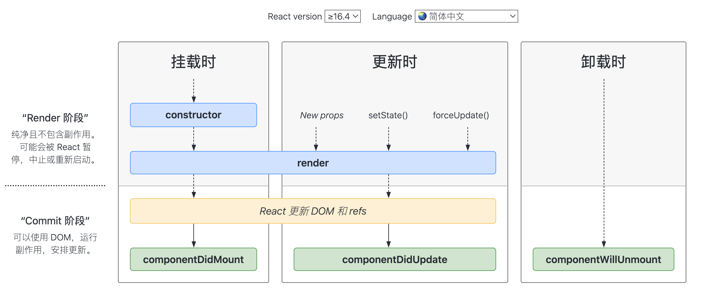
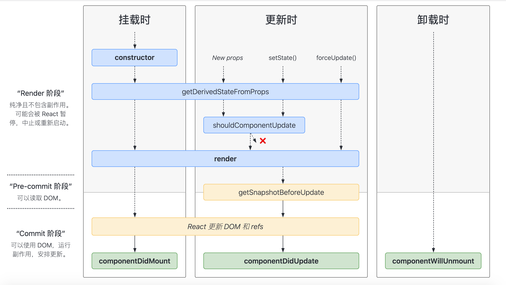

# 生命周期（新）17.0.x

### static getDerivedStateFromProps(props, state)
- 此方法适用于罕见的用例，即 state 的值在任何时候都取决于 props。
- 它应返回一个对象来更新 state，如果返回 null 则不更新任何内容。
  
### getSnapshotBeforeUpdate(prevProps, prevState)
- 应返回 snapshot 的值（或 null）
- 在最近一次渲染输出（提交到 DOM 节点）之前调用
- 此处获取滚动位置，内容高度等

### componentDidUpdate(prevProps, prevState, snapshot)

### 新旧生命周期对比
- 去掉了三个“will”周期
- 增加了两个新周期，componentDidUpdate多了一个snapshot参数
