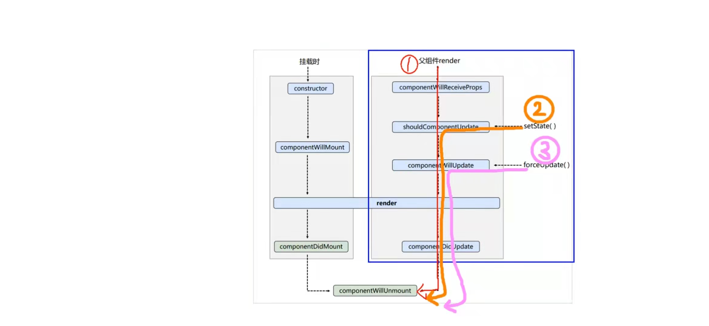

# 生命周期（旧）18.6.x

## 生命周期的三个阶段

### 一、挂载阶段

#### 1、 constructor
- 接收props，state初始化
  
#### 2、 componontWillMount
#### 3、 render
#### 4、 componentDidMount
- render了一次后，已经更新了DOM和refs
- 此处一般会发送请求、开启定时器、订阅消息

### 二、更新阶段 （三种情况）

#### 1、componentWillReceiveProps(nextProps)
- 【父组件】【更新】时，子组件中会调用，第一次组件加载，非父组件更新时不调用

#### 2、shouldComponentUpdate(nextProps, nextState)
- 更新阀门，setState()更新时触发，需要返回true/false来表明是否执行之后的生命周期
- 如果是forceUpdate()更新，则不触发此阀门，直接执行之后的生命周期
  
#### 3、componentWillUpdate(nextProps, nextState)
#### 4、render
#### 5、componentDidUpdate(prevProps, prevState)
- 会在更新后会被立即调用。首次渲染不会执行此方法

### 三、销毁阶段
#### componentWillUnmount()
- 清除 timer，取消网络请求或清除在 componentDidMount() 中创建的订阅等。
- ReactDom.unmountComponentAtNode(document.getElementById('root'))